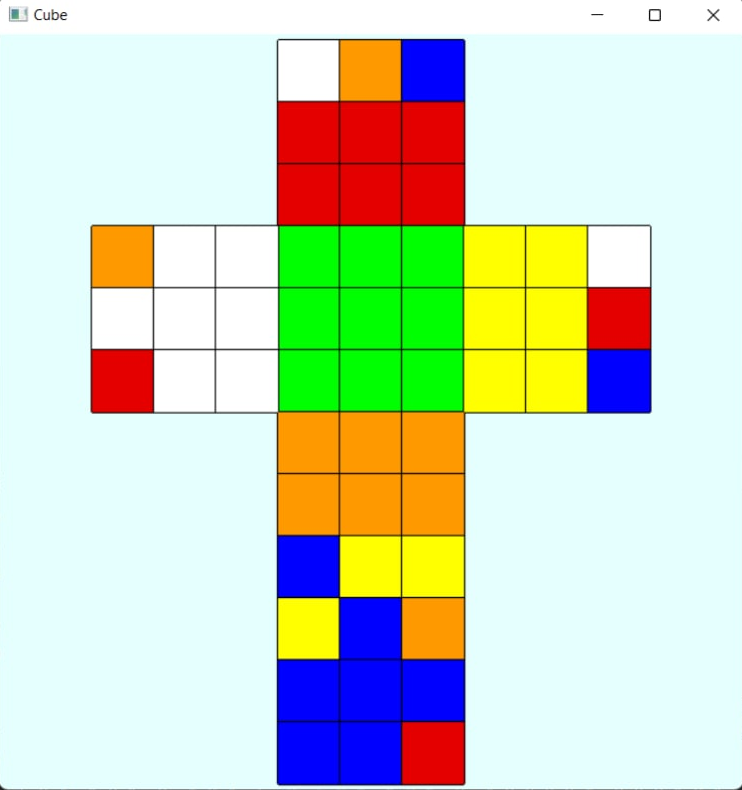

# Visualization of the Rubik's cube

Программа, имитирующую сборку Кубика Рубика 3x3.
 
 

Программа поддеживает следующие функциональные требования:

  - Сохранение и чтение состояния кубика рубика из файла

  - Проверка корректности текущего состояния (инвариант состояний кубика)

  - Вывод в консоль текущего состояния

  - Вращение граней кубика рубика с помощью вводимых команд и клавиатуры

  - Генерация случайного состояния Кубика Рубика, корректного с точки зрения
инварианта состояний

  - Нахождения “решения” для текущего состояния в виде последовательности
поворотов граней
 
 

Нефункциональные требования:

- Программа спроектирована, с использованием ОПП

- Логические сущности выделены в отдельный классы

 
 

Реализован графический интерфейс приложения, с использование OpenGL Utility
Toolkit

### Пример развёртки

